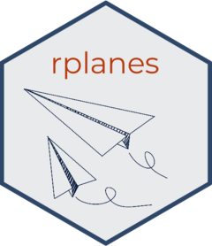

<!-- README.md is generated from README.Rmd. Please edit that file -->

```{r, include = FALSE}
knitr::opts_chunk$set(
  collapse = TRUE,
  comment = "#>",
  fig.path = "man/figures/README-",
  out.width = "100%"
)
```

# rplanes

<a href="https://signaturescience.github.io/rplanes/"></a>

<!-- badges: start -->
[](https://github.com/signaturescience/rplanes/actions/workflows/R-CMD-check.yaml)
<!-- badges: end -->

> **DEVELOPMENT STATUS**: The `rplanes` package is being actively developed. As of v0.0.2 the package is under alpha release. Users should be aware that there may be significant changes to the API in this phase.

## Introduction

The `rplanes` package (**pl**ausibility **an**alysis of **e**pidemiological **s**ignals) provides functionality to prepare data and analyze plausibility of both forecasted and reported epidemiological signals. The functions implement a set of plausibility algorithms that are agnostic to geographic and time resolutions and are calculated independently and then presented as a combined score. 


## Installation

``` r
#install.packages("remotes")
remotes::install_github("signaturescience/rplanes", build_vignettes=TRUE)
```

## Getting Started

The `rplanes` package includes vignettes describing package features in detail. To get started, refer to the "Basic Usage" vignette on the [package website](https://signaturescience.github.io/rplanes/articles/basic-usage.html) or in the R console:

```r
vignette("basic-usage", package="rplanes")
```

## Contributing

Please use GitHub issues to report bugs or request features. Contributions will be reviewed via pull requests.
