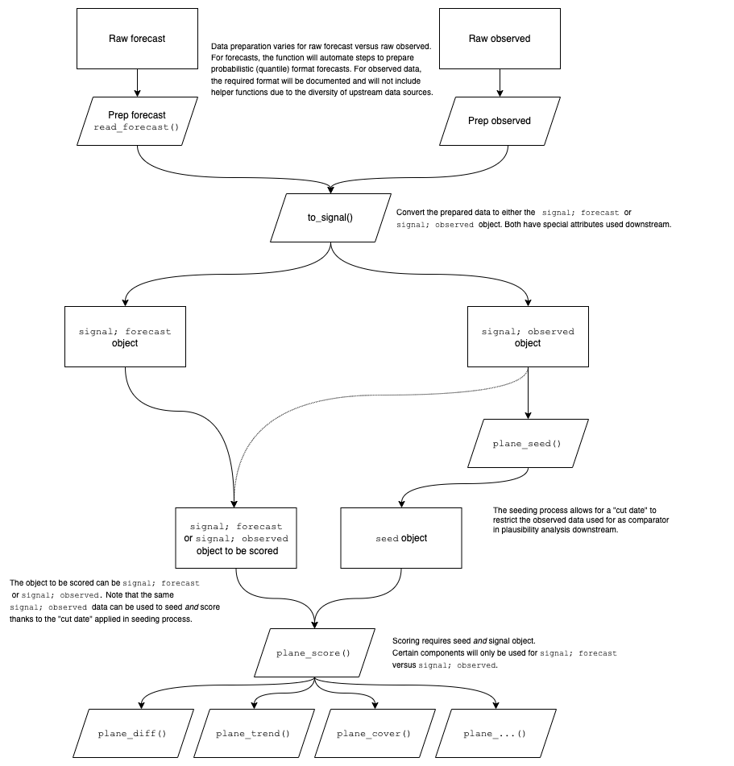

```{r, include = FALSE}
knitr::opts_chunk$set(
  collapse = TRUE,
  echo=TRUE,
  comment = "#>",
  warning=FALSE,
  message=FALSE,
  fig.width = 7,
  fig.height = 5
)
```

```{r setup, echo=FALSE}
library(rplanes)
```

# Overview

The `rplanes` package (**pl**ausibility **an**alysis of **e**pidemiological **s**ignals) provides functionality to prepare data and analyze plausibility of both forecasted and observed epidemiological signals. The functions implement a set of plausibility algorithms that are agnostic to geographic and time resolutions and are calculated independently and then presented as a combined score. The package allows users to:

1. Prepare signal data (either forecast or observed) to be evaluated
2. Create a set of baseline characteristics for previously observed data
3. Compare those characteristics to the evaluated data for each location
4. Synthesize individual component results into an overall score

The package workflow is demonstrated in detail below (see **Figure 1**).

{#id .class width=90% height=100%}

**Figure 1** provides a detailed description of the workflow used in `rplanes`. The `rplanes` processing begins with forecast or observed data prepared in a pre-specified format. The required input data format is documented in the package. For convenience, the package includes the `read_forecast()` function to prepare forecast data that is in the quantile format commonly used in forecasting hubs. The prepped forecast or observed data is then converted to a signal object using `to_signal()`. The signal data will be compared against baseline characteristics for previously observed data at each location. These characteristics are aggregated using `plane_seed()`. With the seed and the signal data prepared, the user can run the plausibility scoring independently for each location in the evaluated data. Scores are comprised of individual binary plausibility components. The functions that drive each component are wrapped in the `plane_score()` function for ease-of-use. By default the `plane_score()` wrapper will try to use all relevant components, however the user can dictate specific components as needed. It is important to note that depending on the type of signal to be evaluated (i.e., forecast versus observed data), some components may not apply.

# Analyzing plausibility of forecast data

Plausibility analysis can support operational forecasting and outbreak analytic activities. Here we demonstrate how to use `rplanes` to score an example forecasted data set.

Several packages must be loaded prior to conducting the analysis:

```{r message = FALSE}
library(rplanes)
library(dplyr)
library(purrr)
library(ggplot2)
```

## Prepare observed data

To motivate this example we will use incident flu hospitalization reported via [HHS Protect](https://healthdata.gov/Hospital/COVID-19-Reported-Patient-Impact-and-Hospital-Capa/g62h-syeh). Note that the data here has been aggregated from daily to weekly resolution, and is provided in this format as internal `rplanes` package data. We select only the columns in which we're interested ("date", "location", and "flu.admits") and make sure that the date field is formatted as a date:

```{r, eval=FALSE}
hosp_all <-
  read.csv(system.file("extdata/observed/hdgov_hosp_weekly.csv", package = "rplanes")) %>%
  select(date, location, flu.admits) %>%
  mutate(date = as.Date(date))

head(hosp_all)
```

```{r, eval = TRUE, echo=FALSE}
hosp_all <-
  read.csv(system.file("extdata/observed/hdgov_hosp_weekly.csv", package = "rplanes")) %>%
  select(date, location, flu.admits) %>%
  mutate(date = as.Date(date))

knitr::kable(head(hosp_all))
```

It is important to emphasize that the observed data must at minimum include columns for location (geographic unit such as FIPS code), date (date of reported value; must be date class), and a reported value for each location/date combination.

## Convert observed data into a signal with `to_signal()`

The downstream plausibility analysis requires that observed and/or forecasted data be converted to an S3 "signal" class. The `to_signal()` function constructs this object and applies an additional "observed" or "forecast" class depending on the type of signal specified.

Here we will convert the observed data from above to a signal object:

```{r}
observed_signal <- to_signal(input = hosp_all, outcome = "flu.admits", type = "observed", resolution = "weeks", horizon = NULL)
```

## Create a seed from the observed data via `plane_seed()`

The `plane_seed()` function provides a means to internally calculate and store baseline characteristics for the observed data in what the package calls a "seed". These characteristics are summarized independently for each location, and are then used in downstream scoring functions.

In this example, we input the prepped observed signal object and make use of the "cut_date" argument. By restricting to dates on or before the specified cut date, we ensure that the baseline characteristics are not computed based on data that overlaps with the forecast. In practice, it may be possible to use the default (`NULL`) cut date when analyzing forecasts, so long as the reported data is available up to (and not exceeding) the first horizon of the forecast.

```{r}
prepped_seed <- plane_seed(observed_signal, cut_date = "2022-10-29")
```

## Prepare forecast data

The forecast data to be assessed must include a point estimate and some representation of uncertainty (i.e., prediction interval) for each location and horizon. For analysis in `rplanes`, the forecast data must be prepared to include the following:

* `location`: Geographic unit such as FIPS code
* `date`: Date corresponding the forecast horizon
* `horizon`: Forecast horizon
* `lower`: Lower limit of a given prediction interval for the forecast
* `point`: Point estimate for the forecast
* `upper`: Upper limit of a given prediction interval for the forecast

For convenience, the `rplanes` package includes `read_forecast()` to convert forecasts from a quantile format used by many forecast hubs[^c19fh]<sup>,</sup>[^fs] into the format needed for plausibility analysis. The `read_forecast()` function reads csv input and returns a `tibble` with summarized forecast data for each location and horizon in the original file. 

[^c19fh]: https://github.com/reichlab/covid19-forecast-hub
[^fs]: https://github.com/cdcepi/Flusight-forecast-data

For this example, we use a forecast of incident weekly flu hospitalizations. This forecast is originally in the quantile format referenced above and is included in `rplanes` as example data:

```{r, echo=TRUE, eval=FALSE}
forecast_fp <- system.file("extdata/forecast/2022-10-31-SigSci-TSENS.csv", package = "rplanes")

read.csv(forecast_fp) %>% 
  head(.)
```

```{r, echo=FALSE, eval=TRUE}
forecast_fp <- system.file("extdata/forecast/2022-10-31-SigSci-TSENS.csv", package = "rplanes")

read.csv(forecast_fp) %>% 
  head(.) %>%
  knitr::kable(.)
```

We can use `read_forecast()` to load the data and convert to the required format:

```{r, echo=TRUE, eval=FALSE}
prepped_forecast <- read_forecast(forecast_fp)

head(prepped_forecast)
```

```{r, echo=FALSE, eval=TRUE}
prepped_forecast <- read_forecast(forecast_fp)

knitr::kable(head(prepped_forecast))
```

## Convert forecast data into a signal with `to_signal()`

With the forecast formatted appropriately, we can convert it to a signal object:

```{r}
forecast_signal <- 
  prepped_forecast  %>%
  to_signal(., outcome = "flu.admits", type = "forecast", resolution = "weeks", horizon = 4)
```

## Run `plane_score()` and visualize results

The `planes_score()` function wraps PLANES scoring for plausibility components across all locations in a single step. The function can accept arguments to specific component functions and allows the user to dictate which components to use (with a default to all). For more about these arguments see `?plane_score`.

We pass the input forecast signal to the function along with the prepped seed to run the scoring independently at all locations:

```{r}
scores <- plane_score(input = forecast_signal, seed = prepped_seed)
```

Note that if we had other forecasts to evaluate for the same time period, we could prepare each forecast signal appropriately and use the same seed (i.e., we would not have to recreate the seed for each forecast). 

The output of `plane_score()` is a list of scoring results for all locations. We can convert the `scores_summary` element from that list to a `tibble`. The `res` object below shows the location, the number of flags raised ("n_flags"), the number of components tested ("n_components"), the "score" (which is "n_flags" divided by "n_components"), the names of components tested, and the names of the components that were flagged (if any):

```{r, echo=TRUE, eval=FALSE}
res <-
  scores$scores_summary %>%
  map_df(., as_tibble)
  
head(res)
```

```{r, echo=FALSE, eval=TRUE}
res <-
  scores$scores_summary %>%
  map_df(., as_tibble)
  
knitr::kable(head(res))
```


```{r fig.align = 'center'}
res %>%
  count(score) %>%
  mutate(score = as.character(score)) %>%
  ggplot(aes(score,n)) +
  geom_col() +
  labs(x = "Score", y = "Count")
```

For the evaluated forecast, most of the locations had one or fewer of the flags raised. However, several locations had two or three of the five possible components flagged for implausibility.

# Analyzing plausibility of observed data

One might want to test observed or reported data for plausibility to check for phenomena like backfill or systematic errors in reporting mechanisms. The steps to use `rplanes` to analyze plausibility of observed data are very similar to forecast assessments. The input data must be converted to a signal, which is passed (along with a seed) to the scoring function. However, the key difference is that for observed data the same data source used to create the input signal can be used for seeding, albeit with a cut date to differentiate data to be evaluated from baseline.

## Prepare observed data

For this example, we will also use the reported HHS Protect flu hospitalization data. However, we will truncate this data to stop at the end of 2022. In this scenario, we will be interested in assessing the most recent reported week (i.e., the week of 2022-12-31) for plausibility. 

Note that in practice, it may be of interest to assess multiple time points for recently observed data.

To begin, we will read in the data and filter it to dates prior to 2023:

```{r, eval=FALSE}
hosp_pre23 <-
  read.csv(system.file("extdata/observed/hdgov_hosp_weekly.csv", package = "rplanes")) %>%
  select(date, location, flu.admits) %>%
  mutate(date = as.Date(date)) %>%
  filter(date < as.Date("2023-01-01"))

head(hosp_pre23)
```

```{r, eval = TRUE, echo=FALSE}
hosp_pre23 <-
  read.csv(system.file("extdata/observed/hdgov_hosp_weekly.csv", package = "rplanes")) %>%
  select(date, location, flu.admits) %>%
  mutate(date = as.Date(date)) %>%
  filter(date < as.Date("2023-01-01"))

knitr::kable(head(hosp_pre23))
```

## Convert observed data into a signal with `to_signal()`

With the data loaded, we can convert the hospitalization `tibble` to a signal object:

```{r}
observed_signal <- to_signal(input = hosp_pre23, outcome = "flu.admits", type = "observed", resolution = "weeks", horizon = NULL)
```

## Create a seed from the observed data via `plane_seed()`

We can use the observed the signal as the input to `plane_score()`, but also as the input to `plane_seed()`. However, to do so we must use an argument that restricts the seeding to *only* dates prior to the cut date (inclusive). 

In this example, because we are assessing the observed data for the week of 2022-12-31 we would want to seed our plausibility analysis with characteristics up through the most recent reported date (i.e., 2022-12-24):

```{r}
prepped_seed <- plane_seed(observed_signal, cut_date = "2022-12-24")
```

## Run `plane_score()` and visualize results

As with the forecast assessments, the PLANES scoring is wrapped for convenience in the `plane_score()` function. Since we are assessing an observed signal in this case, we can explicitly tell the scoring to use certain components. It is important to emphasize that not all components will work for both forecasts and observed signals. Currently, `plane_cover()`, `plane_taper()`, and `plane_trend()` (all of which are run inside `plane_score()`) work only for forecasts and not for observed data:

```{r}
scores <- plane_score(observed_signal, seed = prepped_seed, components = c("repeat","diff"))
```

```{r, echo=TRUE, eval=FALSE}
res <-
  scores$scores_summary %>%
  map_df(., as_tibble)
  
head(res)
```

```{r, echo=FALSE, eval=TRUE}
res <-
  scores$scores_summary %>%
  map_df(., as_tibble)
  
knitr::kable(head(res))
```

```{r fig.align = 'center'}
res %>%
  count(score) %>%
  mutate(score = as.character(score)) %>%
  ggplot(aes(score,n)) +
  geom_col() +
  labs(x = "Score", y = "Count")
```

These results indicate that there is just one location for which any flag has been raised. Again, in this case only two components are used for scoring so the results should be interpreted accordingly. Furthermore, we have to consider that for reported signals the date at which the observed data is retrieved is paramount. It will likely be most meaningful to analyze plausibility of observed data in real time (or near real time) as opposed to retrospectively, since backfill and reporting issues may be corrected prior to assessment.
